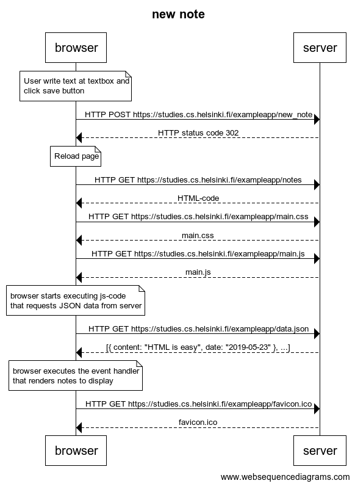
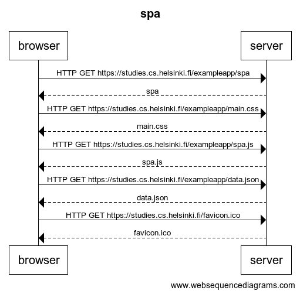
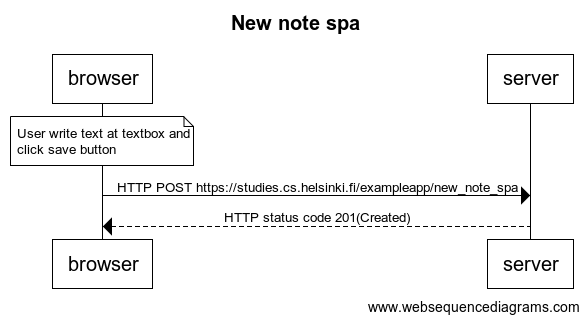

# [Part 0 - Fundamentals of Web apps](https://fullstackopen.com/en/part0)

In this part, we will familiarize ourselves with the practicalities of taking the course. After that we will have an overview of the basics of web development, and also talk about the advances in web application development during the last few decades.

a. [General info](https://fullstackopen.com/en/part0/general_info)  
b. [Fundamental of Web apps](https://fullstackopen.com/en/part0/fundamentals_of_web_apps)

# Exercises
## New note
Create a similar diagram depicting the situation where the user creates a new note on [page](https://studies.cs.helsinki.fi/exampleapp/notes)  when writing something into the text field and clicking the submit button.

## Single page app
Create a diagram depicting the situation where the user goes to the [single page app](https://studies.cs.helsinki.fi/exampleapp/spa) version of the notes app.

## New note at single page
Create a diagram depicting the situation where the user creates a new note using the single page version of the app.

